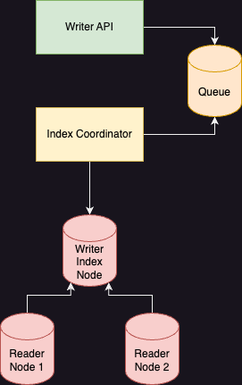

# Sharding and Scaling

This proposal is attempting to synthesize all the ideas around architectural
design for scaling. Most importantly, this proposal details how to leverage
index unification with sharding and shard management strategy to scale NucliaDB
for larger datasets.

## Current solution/situation

Currently, our IndexNode contains our shards. Each shard contains multiple
types of indexes for vector, bm25(with tantivy) and graph capabilities. The implementation
of each index type involves many managed files, threads, etc and can be
quite complex.

Readers and Writers of a shard must be on the same physical machine for a shard.
Right now, that also means a single Kubernetes Pod(part of stateful set).

While we can "rebalance" nodes to some extent, we don't have good metrics
to really know how we should rebalance. Disk size is not a good metric to
know usage of shard.

Moreover, moving a shard is currently tedious. The only implemented option for us
is to reindex a shard on a new shard and cutover the reference of the node the shard is on.
Another option could be to copy all the files; however, this is also slow, error prone,
requires locks and places coupling on the ingest component and our IndexNodes.

Overview of current problems:
- IndexNode is managing multiple types of indexes seperately. High overhead.
- CPU tied to disk and difficult to move shards aroundd
- Reads/writes coupled to disk
- Can not add replicas for an existing KB's shards
- Coupling with shard management and ingest

## Proposed Solution

The proposed solution is oriented around providing a unified index to simplify
how we store shard data on the IndexNode.

With a unified index implementation, it is feasible to provide more
capabilities around sharding(dynamic replicas, rebalancing).

### Unified Index

By "unified index," we are referring to an index that stores all data
in a single disk format that hnsw, bm25, etc can then utilize.

An important aspect of this unified index design is that it also provides
segmented storage. By segmented storage, we mean that each write should
produce a new segment. That new segment will work along with other existing
segments to provide the shard's full dataset.

[more details on the implementation provided elsewhere]

#### Breaking changes

- Split from tantivy: Tantivy is not compatible with this approach.
- No full entity graph implementation built in
- No advanced query support

### Replication

Each shard will have a commit log to track changes through time and
communicate changes to read replicas.

- Commit log is append only file for each shard which tracks all segments
  and their files. This is then used for replication to read replicas.
- Writers are responsible for replicating data to readers consistently
    - 2 phase "commit". First write files everywhere. Second, "turn on" new files.
    - Having writers responsible for replication allows us to avoid needing
      to implement something like raft to coordinate read replica state
    - Writers then know when/how to 
- Readers are responsible for merging segments

### Index Coordinator

The Index Coordinator is the component responsible for managing the
IndexNode cluster.

The Index coordinator is the only component that should "know" about
what shards a Knowledge Box has and how to correctly query or write to them.

Responsibilities:
- Configuring writers and replication
- Know writer and reader health
- Balancing shards across cluster
    - Place new shards appropriately
    - Move shards when things are unbalanced
    - Increase replicas for hot shards, reduce for inactive
- Record keeping
    - Shard stats
    - Usage stats
- Index queue consuming, operations

APIs:
- Create Shard
- Delete Shard
- Shard Operation
    - Search
    - etc

### Index Node Writer

- track what shards they are responsible for and their replica settings

Write path diagram:

### Index Node Reader

Read path diagram:

## Alternatives

- Use raft to coordinate reader replication state and have readers
  responsible for their own replication. This proposal focuses on having the
  writer responsible for replicating data.

## Rollout plan

1. Unified index + commit log implementation
2. 
3. Index coordinator

## Success Criteria

[How will we know if the proposal was successful?]
